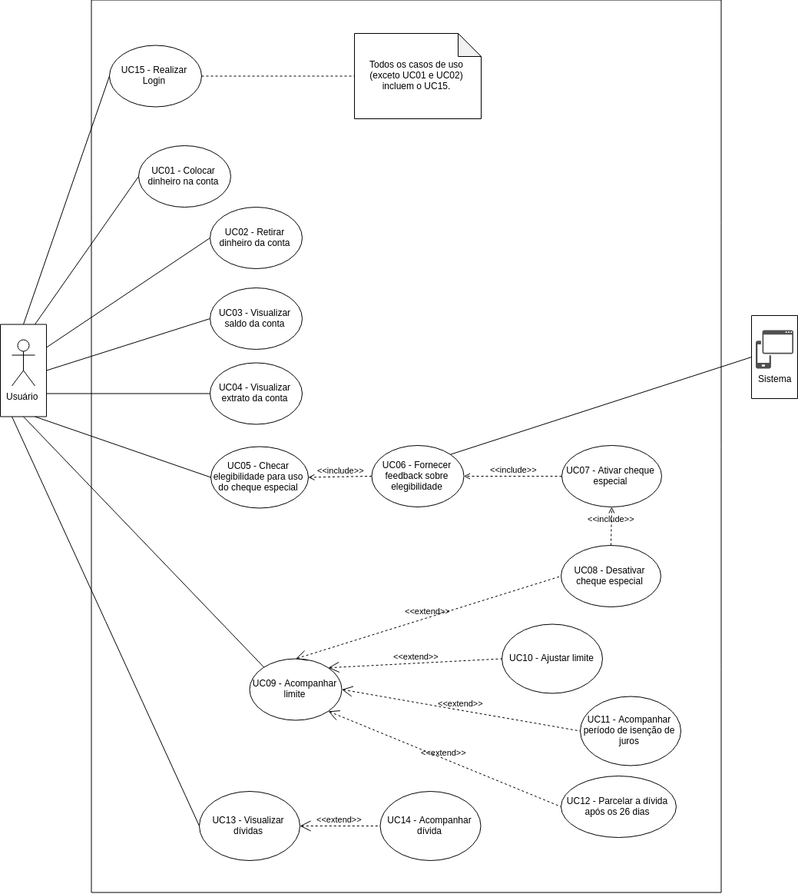
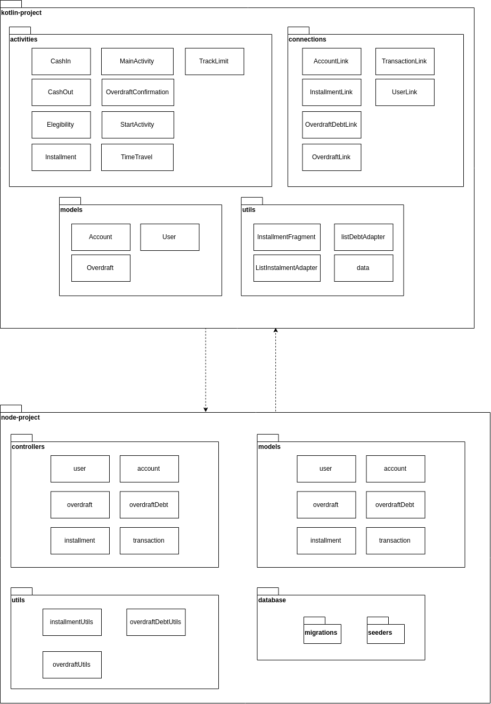
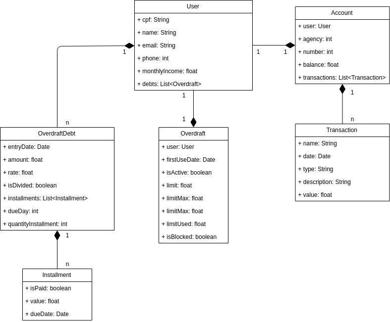
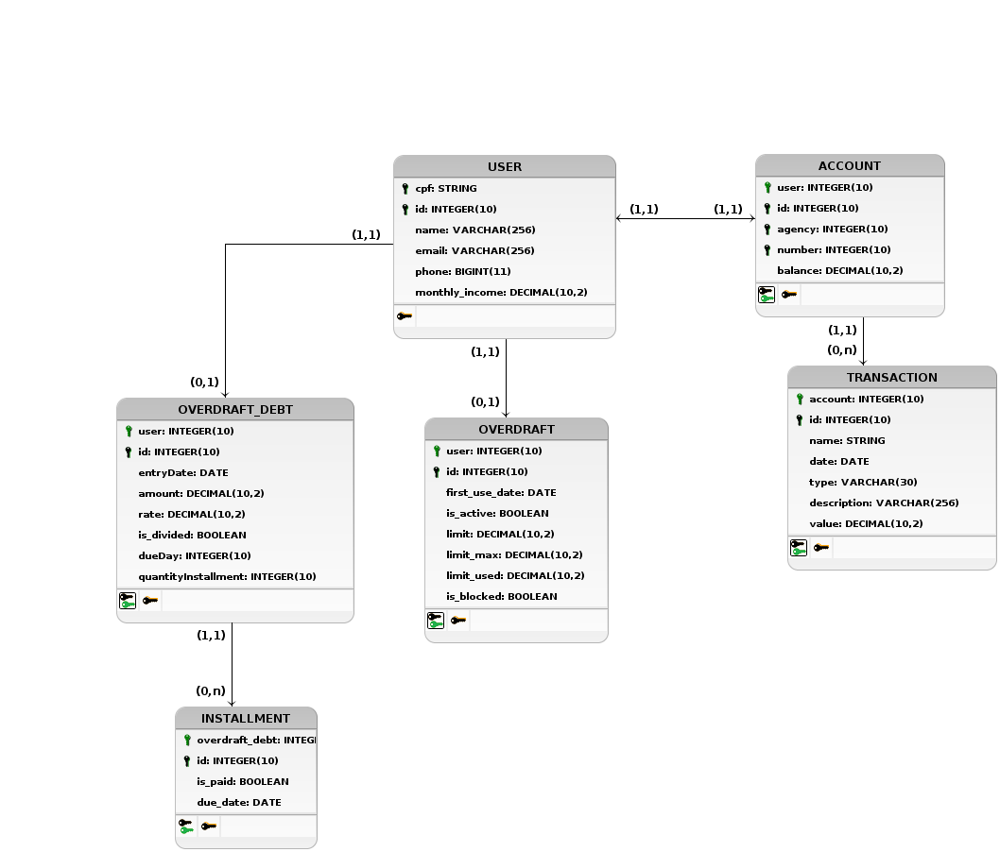

# Documento de Arquitetura

## Histórico de Versões

| Data | Versão | Autor(a) | Descrição |
| - | - | - | - |
| 05/09/2019 | 0.1 | João Gabriel | Criação do índice e adição da introdução|
| 05/09/2019 | 0.2 | Gabriel e João Paulo | Adição da visão lógica e desempenho|
| 06/09/2019 | 0.3 | Isabella | Adição de Restrições do projeto|
| 06/09/2019 | 0.4 | Isabella e João Gabriel | Adição de Qualidade|
| 06/09/2019 | 0.5 | Luiza | Adição de Visão de Casos de Uso|
| 09/09/2019 | 0.6 | Erick | Adição de Representação da Arquitetura e correção de índice|
| 10/09/2019 | 0.7 | Natália, Luiza, João Paulo, Erick, Maria Luiza | Adição do Diagrama de Casos de Uso |
| 11/09/2019 | 0.8 | Luiza | Refatoração da Visão de Casos de Uso|
| 11/09/2019 | 0.9 | Erick | Corrigindo índice|
| 11/09/2019 | 1.0 | Erick | Refatorando desempenho e realocando restrições|
| 11/09/2019 | 1.1 | João Gabriel| Refatoração da introdução|
| 11/09/2019 | 1.2 | Natália | Adição do diagrama de classes e do diagrama lógico |
| 13/09/2019 | 1.3 | João Paulo e Gabriel | Refatoração da Visão Lógica |
| 24/09/2019 | 1.4 | Natália | Refatoração do diagrama de classes e do diagrama lógico |
| 01/10/1029 | 1.5 | Isabella Carneiro | Refatoração do Documento de Arquitetura |
| 02/10/2019 | 1.6 | Natália Rodrigues | Modificando diagrama e descrição dos casos de uso |
| 02/10/2019 | 1.7 | Natália Rodrigues | Atualizando diagramas de classe e lógico e adicionando diagrama de pacotes | 
| 07/10/2019 | 1.8 | Maria Luiza | Ajustando imagens do documento | 

- [1. Introdução](#_1-introdução)
  * [1.1. Objetivos](#_11-objetivos)
  * [1.2. Escopo do documento](#_12-escopo-do-documento)
- [2. Representação da Arquitetura](#_2-representação-da-arquitetura)
- [3. Restrições e Metas Arquiteturais](#_3-restrições-e-metas-arquiteturais)
  * [3.1. Restrições](#_31-restrições)
  * [3.2. Metas Arquiteturais](#_32-metas-arquiteturais)
- [4. Visão de Casos de Uso](#_4-visão-de-casos-de-uso)
  * [4.1. Diagrama de Casos de Uso](#_41-Diagrama-de-Casos-de-Uso)
  * [4.2. Descrição dos Casos de Uso](#_42-Descrição-dos-Casos-de-Uso)
- [5. Visão Lógica](#_5-visão-lógica)
  * [5.1. Visão Geral: Pacotes e Camadas](#_51-visão-geral-pacotes-e-camadas)
  * [5.2. Visão Geral: Classes](#_52-visão-geral-classes)
  * [5.3. Visão Geral: Banco de Dados](#_53-visão-geral-banco-de-dados)

- [6. Desempenho](#_6-desempenho)

- [7. Qualidade](#_7-qualidade)

## 1. Introdução

### 1.1. Objetivos

O objetivo deste documento é detalhar a arquitetura e tecnologias utilizadas no projeto, que se trata de um aplicativo mobile focado na experiência do usuário utilizando uma função de Cheque Especial do banco N26. 

A necessidade deste detalhamento se dá para o melhor entendimento do que está sendo produzido e de que forma está sendo realizado.

###  1.2. Escopo do documento

Este documento contém detalhes sobre a arquitetura escolhida para o sistema, as lógicas por trás das implementações, as linguagens/tecnologias usadas, os padrões estabelecidos pela equipe, informações referentes à bancos de dados, além dos  diagramas de classe e de caso de uso.

## 2. Representação da Arquitetura

A arquitetura utilizada no projeto é a arquitetura Cliente/Servidor, que se baseia na relação de dois módulos, o cliente e o servidor. O servidor será responsável pela manutenção e processamento dos dados, enquanto ao cliente será encarregada a função de fornecer os dados.

No caso deste projeto, o papel de cliente será desempenhado pelo frontend da aplicação, que está sendo implementado em Kotlin, e o de servidor pela API, implementada em Node.js, que faz toda a comunicação com a camada de persistência dos dados.

## 3. Restrições e Metas Arquiteturais

### 3.1. Restrições

O sistema será desenvolvido para ser utilizado em smartphones com sistema Android. Para alcançar tal finalidade, o backend do sistema, API que fará a comunicação com o banco de dados, será desenvolvido utilizando o Node.js com o framework Express e o frontend, que fará interface com o usuário final, em Kotlin.

### 3.2. Metas Arquiteturais

O sistema deve garantir uma boa experiência do usuário durante sua utilização, busca-se eficiência e respostas rápidas às requisições e uma aplicação amigável do ponto de vista do usuário. Ele também deverá atender aos requisitos não funcionais, como o estruturamento de código, para que assim seja garantida a manutenibilidade do projeto.

## 4. Visão de Casos de Uso

### 4.1. Diagrama de Casos de Uso

### 4.2. Descrição dos Casos de Uso

#### UC01 - Colocar dinheiro na conta
|||
|-|-|
**Descrição** | Este caso de uso se refere à funcionalidade que tem como objetivo a inserção de dinheiro na conta do usuário
**Atores** | Usuário
**Pré-condições** | O usuário deve ter acesso à página web com a interface de _cash-in/cash-out_
**Pós-condições** | O usuário deverá ter inserido dinheiro em sua conta
**Fluxo principal** | 1. Usuário acessa interface de cash-in/cash-out   2. Usuário preenche os campos e escolhe a opção "Entrada"   3. Usuário clica em "Criar" [FE01]   4. Dinheiro entra na conta preenchida pelo usuário
**Fluxo de exceção** | **FE01 - Conexão**   Se houver algum problema de conexão, a operação pode não ser concluída com sucesso

#### UC02 - Retirar dinheiro da conta
|||
|-|-|
**Descrição** | Este caso de uso se refere à funcionalidade que tem como objetivo a retirada de dinheiro da conta do usuário
**Atores** | Usuário
**Pré-condições** | O usuário deve ter acesso à página web com a interface de _cash-in/cash-out_
**Pós-condições** | O usuário deverá ter retirado dinheiro de sua conta
**Fluxo principal** | 1. Usuário acessa interface de cash-in/cash-out   2. Usuário preenche os campos e escolhe a opção "Saída"   3. Usuário clica em "Criar" [FE01]   4. Dinheiro é retirado da conta preenchida pelo usuário
**Fluxo de exceção** | **FE01 - Conexão**   Se houver algum problema de conexão, a operação pode não ser concluída com sucesso

#### UC03 - Visualizar saldo da conta
|||
----- | ----- 
**Descrição** | Este caso de uso se refere à  funcionalidade que tem como objetivo mostar o saldo da conta do usuário
**Atores** | Usuário
**Pré-condições** | O usuário deverá ter realizado login na aplicação [UC15]
**Pós-condições** | O usuário deverá ter visualizado o saldo 
**Fluxo principal** | 1. O usuário abre a aplicação   2. O usuário visualiza o saldo da sua conta na tela inicial [FE01]
**Fluxo de exceção** | **FE01 - Conexão**  Se houver algum problema de conexão, a operação pode não ser concluída com sucesso

#### UC04 - Visualizar extrato da conta
|||
----- | ----- 
**Descrição** | Este caso de uso se refere à funcionalidade que tem como objetivo apresentar as transações realizadas pelo usuário.
**Atores** | Usuário
**Pré-condições** | O usuário deverá ter realizado login na aplicação [UC15]
**Pós-condições** | O extrato completo deverá ter sido apresentado
**Fluxo principal** | 1. O usuário clica em "Extrato da Conta" [FE01]   2. O extrato é mostrado na tela
**Fluxo de exceção** | **FE01 - Conexão**  Se houver algum problema de conexão, a operação pode não ser concluída com sucesso

#### UC05 - Checar elegibilidade para uso do cheque especial
|||
----- | ----- 
**Descrição** | Este caso de uso se refere à funcionalidade que tem como objetivo checar a elegibilidade do usuário para usar o cheque especial.
**Atores** | Usuário
**Pré-condições** | O usuário deverá ter realizado login na aplicação [UC15]
**Pós-condições** | O usuário deve ter conseguido checar sua elegibilidade para uso do cheque especial
**Fluxo principal** | 1. O usuário entra na tela de cheque especial   2. O usuário clica em "Avaliar Cheque Especial" [FE01]   3. O usuário recebe o feedback da avaliação [UC06]
**Fluxo de exceção** | **FE01 - Conexão**  Se houver algum problema de conexão, a operação pode não ser concluída com sucesso

#### UC06 - Fornecer feedback sobre elegibilidade
|||
----- | -----
**Descrição** | O sistema fornece ao usuário o retorno sobre sua solicitação de avaliação da elegibilidade de uso do cheque especial [UC05] |
**Atores** | Sistema |
**Pré-condições** | O usuário deverá ter solicitado checagem da elegibilidade para uso do cheque especial |
**Pós-condições** | O usuário deverá ter recebido o retorno de sua solicitação |
**Fluxo principal** | 1. O sistema redireciona o usuário para a página com o feedback [FA01] [FA02] [FE01]|
**Fluxos alternativos** | **FA01 - Usuário elegível**   Se o usuário for elegível, o sistema deve redirecioná-lo para a tela de ativação do cheque especial   **FA02 - Usuário não elegível**   Se o usuário não for elegível, o sistema deve redirecioná-lo para uma tela com a mensagem de inelegibilidade.
**Fluxo de exceção** | **FE01 - Conexão**  Se houver algum problema de conexão, a operação pode não ser concluída com sucesso

#### UC07 - Ativar cheque especial
|||
----- | ----- 
**Descrição** | Este caso de uso se refere à funcionalidade que permite que o usuário ative o o cheque especial na sua conta |
**Atores** | Usuário |
**Pré-condições** | O usuário deverá ter realizado login na aplicação [UC15], deve ter solicitado a análise de elegibilidade e deve ser elegível para uso do cheque especial |
**Pós-condições** | O limite de cheque especial deverá estar disponível para o uso do usuário |
**Fluxo principal** | 1. O usuário marca o _checkbox_ concordando com os termos de uso do cheque especial   2. O usuário clica em "Ativar Cheque Especial" [FE01]   3. O cheque especial é ativado e fica disponível para uso 
**Fluxo de exceção** | **FE01 - Conexão**  Se houver algum problema de conexão, a operação pode não ser concluída com sucesso

#### UC08 - Desativar cheque especial

|||
----- | ----- 
**Descrição** | Este caso de uso se refere à funcionalidade que permite que o usuário desative o o cheque especial em sua conta |
**Atores** | Usuário |
**Pré-condições** | O usuário deverá ter realizado login na aplicação [UC15] e deve ter ativado o cheque especial [UC07] |
**Pós-condições** | O cheque especial deverá ter sido desativado |
**Fluxo principal** | 1. O usuário entra na tela de acompanhar limite do cheque especial [UC09]   2. O usuário clica em "Desativar Cheque Especial" [FE01]   3. O cheque especial é desativado e fica indisponível para uso 
**Fluxo de exceção** | **FE01 - Conexão**  Se houver algum problema de conexão, a operação pode não ser concluída com sucesso

#### UC09 - Acompanhar limite
|||
----- | ----- 
**Descrição** | Este caso de uso se refere à funcionalidade que permite que o usuário acompanhe seu limite de cheque especial |
**Atores** | Usuário |
**Pré-condições** | O usuário deve realizado login na aplicação [UC15] e deve ter ativado o cheque especial [UC07] |
**Pós-condições** | O usuário deverá ter conseguido acompanhar seu limite |
**Fluxo principal** | 1. O usuário entra na tela de acompanhar limite do cheque especial   2. O usuário visualiza quantidade do limite utilizado, limite de uso definido por ele e limite máximo que pode ser usado [FA01] [FA02] [FA03] [FA04] [FE01]  
**Fluxos Alternativos** | **FA01 - Desativar cheque especial** [UC08]   **FA02 - Ajustar limite** [UC10]   **FA03 - Acompanhar período de isenção de juros** [UC11]   **FA04 - Parcelar a dívida após os 26 dias** [UC12]
**Fluxo de exceção** | **FE01 - Conexão**  Se houver algum problema de conexão, a operação pode não ser concluída com sucesso

#### UC10 - Ajustar limite
|||
----- | ----- 
**Descrição** | Este caso de uso se refere à funcionalidade que permite que o usuário ajuste o seu limite de uso de cheque especial |
**Atores** | Usuário |
**Pré-condições** | O usuário deve realizado login na aplicação [UC15] e deve ter entrado na tela de acompanhar limite [UC09] |
**Pós-condições** | O usuário deverá ter conseguido ajustar seu limite de uso |
**Fluxo principal** | 1. O usuário entra na tela de acompanhar limite do cheque especial [UC09]   2. O usuário ajusta barra de limite com o valor desejado   3. O usuário clica em "Salvar"   4. Limite de uso do cheque especial é ajustado [FE01]
**Fluxo de exceção** | **FE01 - Conexão**  Se houver algum problema de conexão, a operação pode não ser concluída com sucesso

#### UC11 - Acompanhar período de isenção de juros

|||
----- | ----- 
**Descrição** | Este caso de uso se refere à funcionalidade que permite que o usuário acompanhe o período de isenção de juros do cheque especial |
**Atores** | Usuário |
**Pré-condições** | O usuário deve realizado login na aplicação [UC15] e deve ter entrado na tela de acompanhar limite [UC09] |
**Pós-condições** | O usuário deverá ter conseguido acompanhar o período de isenção de juros do cheque especial |
**Fluxo principal** | 1. O usuário entra na tela de acompanhar limite do cheque especial [UC09]   2. O usuário clica em "Acompanhar período de isenção do cheque especial" [FA01]   3. O usuário visualiza qual foi o dia da sua primeira utilização do cheque especial e quantos dias faltam para acabar o período de isenção [FE01]
**Fluxo alternativo** | **FA01 - Cheque especial ainda não utilizado**   Se o cheque especial ainda não foi utilizado, o sistema deve mostrar uma mensagem para usuário.
**Fluxo de exceção** | **FE01 - Conexão**  Se houver algum problema de conexão, a operação pode não ser concluída com sucesso

#### UC12 - Parcelar dívida após os 26 dias
|||
----- | ----- 
**Descrição** | Este caso de uso se refere à funcionalidade que permite que o usuário parcele sua dívida após os 26 dias de isenção |
**Atores** | Usuário |
**Pré-condições** | O usuário deve realizado login na aplicação [UC15], deve ter entrado na tela de acompanhar limite [UC09] e deve ter usado o limite do cheque especial sem quitar a dívida dentro do período de 26 dias. |
**Pós-condições** | O usuário deverá ter conseguido parcelar sua dívida no cheque especial |
**Fluxo principal** | 1. O usuário entra na tela de acompanhar limite do cheque especial [UC09]   2. O usuário visualiza valor da dívida   3. O usuário clica em "Parcelar Dívida"   4. O usuário escolhe a quantidade de parcelas   5. O usuário escolhe o melhor dia de vencimento das parcelas   6. O usuário clica em salvar parcelamento.   7. Parcelamento da dívida é realizado com sucesso e usuário é redirecionado para a tela de visualizar dívidas [UC13] [FA01] [FE01]
**Fluxo alternativo** | **FA01 - Usuário cancela o parcelamento**   Se o usuário clicar em "Cancelar" ou no botão "Voltar", o usuário deve ser redirecionado para a página de acompanhar limite [UC09]
**Fluxo de exceção** | **FE01 - Conexão**  Se houver algum problema de conexão, a operação pode não ser concluída com sucesso

#### UC13 - Visualizar dívidas

|||
----- | ----- 
**Descrição** | Este caso de uso se refere à funcionalidade que permite que o usuário visualize as suas dívidas no cheque especial (pagas e pendentes) |
**Atores** | Usuário |
**Pré-condições** | O usuário deve realizado login na aplicação [UC15] |
**Pós-condições** | O usuário deverá ter conseguido visualizar sua lista de dívidas |
**Fluxo principal** | 1. O usuário entra na tela de visualização das dívidas [FA01]   2. O usuário visualiza lista de dívidas (pagas e pendentes) [FA02] [FE01]
**Fluxo alternativo** | **FA01 - Usuário não possui dívidas**   Se o usuário não possuir dívidas, o sistema deve mostrar uma mensagem.   **FA02 - Acompanhar dívida** [UC14]
**Fluxo de exceção** | **FE01 - Conexão**  Se houver algum problema de conexão, a operação pode não ser concluída com sucesso

#### UC14 - Acompanhar dívida

|||
----- | ----- 
**Descrição** | Este caso de uso se refere à funcionalidade que permite que o usuário acompanhe uma dívida em específico da sua lista de dívidas |
**Atores** | Usuário |
**Pré-condições** | O usuário deve realizado login na aplicação [UC15] e deverá ter entrado na tela de visualização de dívidas [UC13] |
**Pós-condições** | O usuário deverá ter conseguido acompanhar dívida das lista de dívidas |
**Fluxo principal** | 1. O usuário clica em uma das dívidas da lista apresentadas na tela de visualizar dívidas   2. O usuário visualiza parcelas da dívida [FE01]
**Fluxo de exceção** | **FE01 - Conexão**  Se houver algum problema de conexão, a operação pode não ser concluída com sucesso

#### UC15 - Realizar Login

|||
----- | ----- 
**Descrição** | Este caso de uso se refere à funcionalidade que permite que o usuário realize login na aplicação |
**Atores** | Usuário |
**Pré-condições** | O usuário deve ter acesso à aplicação |
**Pós-condições** | O usuário deverá ter realizado login na aplicação |
**Fluxo principal** | 1. O usuário abre a aplicação   2. O usuário preenche campos de login e senha   3. O login é efetuado e usuário tem acesso às funcionalidades do sistema [FA01] [FE01]
**Fluxo Alternativo** | **FA01 - Login e/ou senha errado(s)**   Se o usuário preencher um dos campos de maneira errada, o sistema deve exibir uma mensagem de erro
**Fluxo de exceção** | **FE01 - Conexão**  Se houver algum problema de conexão, a operação pode não ser concluída com sucesso

## 5. Visão Lógica

### 5.1. Visão Geral: Pacotes e Camadas

A arquitetura Cliente/Servidor se baseia em dois módulos principais, que farão a comunicação entre si para fornecer ao usuário os serviços necessários. No caso deste projeto, o cliente será a aplicação Kotlin, organizada em pacote(s) interno(s), e o servidor a API REST desenvolvida em Node.js, que utiliza o modelo MVC por padrão e possui módulos internos bem definidos (models, views, controllers, database, etc.). É válido ressaltar que como se trata de uma API REST, o servidor da aplicação não fará uso das views do modelo MVC utilizado pelo Node.

A figura a seguir mostra a estrutura de pacotes do sistema:

### 5.2. Visão Geral: Classes

O diagrama de classes a seguir tem como finalidade demonstrar todas classes, atributos, métodos e tipo de restrição de acesso dos dados utilizados.

Segue o diagrama de classes:

#### Classes

* **User:** Classe destinada ao cliente que abriga todas informações de sua conta.
* **Overdraft:** Classe que detalha as informações referentes ao cheque especial do usuário.
* **OverdraftDebt:** Classe referente às dívidas de cheque especial do usuário.
* **Installment:** Classe referente às parcelas de uma dívida de cheque especial.
* **Account:** Classe que dispõe os dados bancários do cliente, como transações e seu saldo bancário.
* **Transaction:** Classe que detalha as transações realizadas.

#### Relações

* User é composta por OverdraftDebt: Demonstra que um usuário pode ter várias dívidas de cheque especial.
* OverdraftDebt é composta por Installment: Demonstra que uma dívida pode ser parcelada.
* Overdraft é composta por User: Demonstra que a classe de cheque especial está atrelada a um usuário.
* Account é composta por User: Demonstra que um conta só pode ser possuida por um usuário e também que um usuário só pode possuir uma conta.
* Account é composta por Transaction: Demonstra que uma conta pode realizar várias transações, mas que casa transação está associada a apenas uma conta.

### 5.3. Visão Geral: Banco de dados

O banco de dados permite com que os dados sejam persistidos para possibilitar a realização das funções da aplicação. A figura a seguir mostra o esquemático das tabelas do banco de dados do sistema:

## 6. Desempenho

O desempempenho do sistema está relacionado ao aparelho utilizado para rodar a aplicação, entretanto a conexão com a internet é o fator que pode causar os maiores problemas de desempenho.

## 7. Qualidade

A utilização da arquitetura Cliente/Servidor tem como objetivo a modularização e divisão da aplicação em camadas com responsabilidades diferentes e bem definidas. O sistema deve, então, apresentar componentes bem estruturados e testados de forma independente, a fim de garantir a qualidade dos serviços entregues ao usuário final da aplicação.

O código deverá ser bem estruturado, seguindo as normas de Boas Práticas de programação para que terceiros, responsáveis por suas eventuais manutenções, consigam trabalhar sem a necessidade consultar os desenvolvedores originais.
